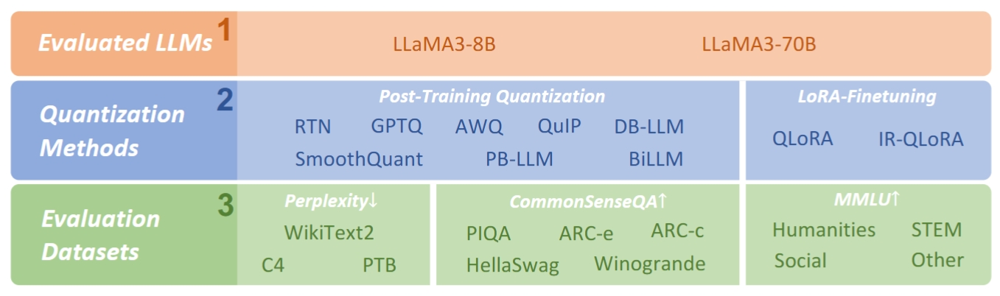
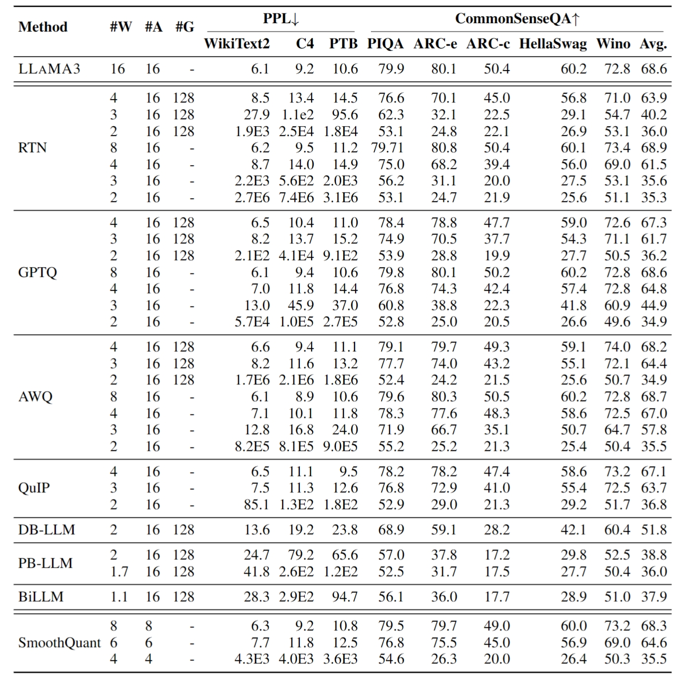
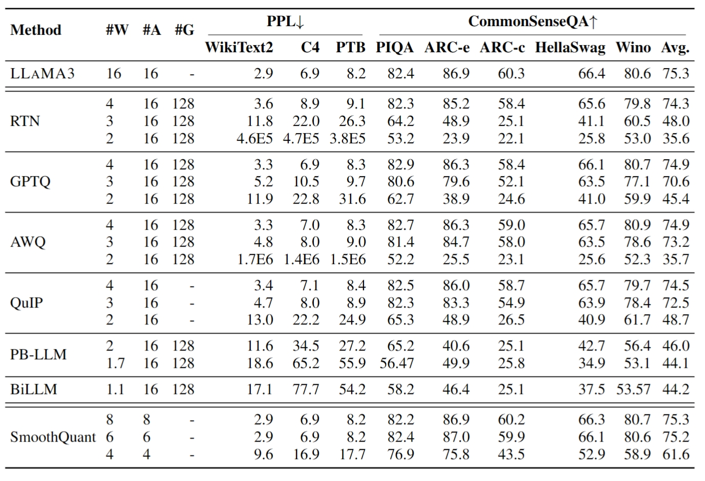
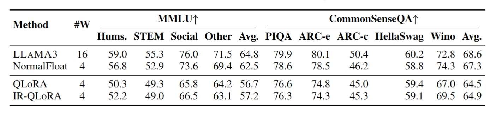

# ⭐Meta's LLaMA3-Quantization🦌💎💫

LLaMA3-Quantization is the official implementation of paper **`"How Good Are Low-bit Quantized LLAMA3 Models?"`**
An Empirical Study [PDF](https://arxiv.org/abs/2404.14047). Created by researchers from The University of Hong Kong, Beihang University and ETH Zürich.

## 🌟 Introduction
- **Meta's LLaMa family** has become one of the most powerful open-source Large Language Model (LLM) series. Notably, **LLaMa3 models** have recently been released and achieve impressive performance across various with super-large scale pre-training on over 15T tokens of data. 
- Given the wide application of low-bit quantization for LLMs in resource-limited scenarios, we explore **LLaMa3's capabilities when quantized to low bit-width**. This exploration holds the potential to unveil new insights and challenges for low-bit quantization of LLaMa3 and other forthcoming LLMs, especially in addressing performance degradation problems that suffer in LLM compression. Specifically, here evaluation is done on the `10 existing post-training quantization and LoRA-finetuning methods of LLaMa3 on 1-8 bits and diverse datasets to comprehensively reveal LLaMa3's low-bit quantization performance.` 
- Experiment Results indicate that LLaMa3 still suffers non-negligent degradation in these scenarios, especially in ultra-low bit-width. This highlights the significant performance gap under low bit-width that needs to be bridged in future developments. And expected that this empirical study will prove valuable in advancing future models, pushing the LLMs to lower bit-width with higher accuracy for being practical. Quantized LLaMa3 models are released on link [🔗](https://huggingface.co/LLMQ).





## 🎯 Usage

Full script is provided to evaluate various quantization methods in `./scripts/`. LLaMa-3-8B used in IR-QLoRA method as an example here:

```shell
python main.py \ 
    --model meta-llama/Meta-Llama-3-8B  \ 
    --peft LLMQ/LLaMA-3-8B-IR-QLoRA \ 
    --tau_range 0.1 --tau_n 100--blocksize 256 \ 
    --epochs 0 \ 
    --output_dir ./log/llama-3-8b-irqlora \ 
    --wbits 4 \ 
    --tasks piqa,arc_easy,arc_challenge,hellaswag,winogrande
```

# 🌟Results 💫

## 👉Track1: Post-Training Quantization🌟


### 🔥Evaluation results of post-training quantization on LLAMA3-8B model🔥

  


### 🔥Evaluation results of post-training quantization on LLAMA3-70B model🔥

  


## 👉Track2: LoRA-FineTuning Quantization🌟

### 🔥LoRA-FT on LLAMA3-8B with Alpaca dataset🔥

  

---

#### **If you like this LLM Project do drop ⭐ to this repo**
#### Follow me on [](https://www.linkedin.com/in/gurpreetkaurjethra/) &nbsp; [](https://github.com/GURPREETKAURJETHRA/)

---
